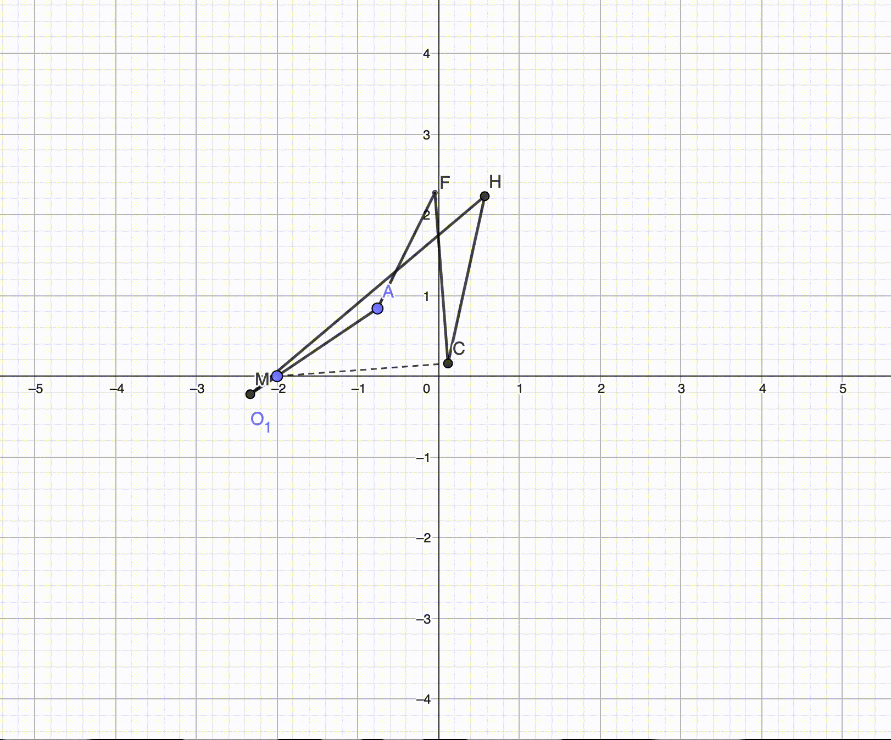

# Assignment 1

**Author:** `Igor Alentev`

**Group:** `BS20-RO-01`

**Email:** `i.alentev@innopolis.university`

**Problem:** [PDF](assets/problem.pdf)

## Task 1 & 3

To build the requred mechanism I have decided to use the standard algorithm of building the mechanism from the lectures. The exact procedure of constructing the first half of the mechanism can be seem in the timelapse video of construction.

However, to make more robust solution, we might want to introduce two stage approach to the operation. In particular, the second stage should catch the metal sheet on half way and land it on the table.

Moreover, after some experimenting I managed to change the ratios of the crank travel times, as a result, the main part of the mechanism has a quick-return behaviour, satisfying the third task requirenment. Which can be seen in the showcase video.

In general, the mechanism is comprised of three four-bars, which formed by actually two four-bar mechanisms. Quick return of the first half allows immidiate operation of the placing procedure, while the second stage is processing, paralleling the stages.

- [Timelapse video](assets/timelapse-4bar.mp4)
- [Showcase video](assets/showcase-4bar.gif)

## Task 2

To introduce the six bar mechanism, I want to further improve already existing structure.

We can notice that if we imagine that the two four-links from previous part are separated, they are operated by two separate input cranks. We can improve the situation, by introducing the single rotational link, which will simultaneously operate on both rockers.

This modification of the previous approach allows us to save the parallelism of the mechanism, since the first stage is with the quick return. This was mechanism becomes very effective in time. The process of modifying the first approach into the second is presented in the timelapse video.

- [Timelapse video](assets/timelapse-6bar.mp4)
- [Showcase video](assets/showcase-6bar.gif)

## Task 4

I found the task to introduce the pneumatic actuator the most difficult in the assignment. There was no straightforward way to change the actuation type of the previous six-bar. Probably there was a way, but I did not find it. Therefore, I had to spend some time on experimenting with concepts, which is reflected in the timelapse video.

The idea is generally the same, we want to make a two-stage mechanism, the first stage drops the sheet on the second one, which accurately places it on the table in the flipped state.

Mechanism structure comprised of two "wings" which meet each other on the pneumatic actuation and spread out on the contraction. This way the structure becomes relatively symmetric and intuitively obvious.

- [Timelapse video](assets/timelapse-pneumatic.mp4)
- [Showcase video](assets/showcase-pneumatic.gif)

